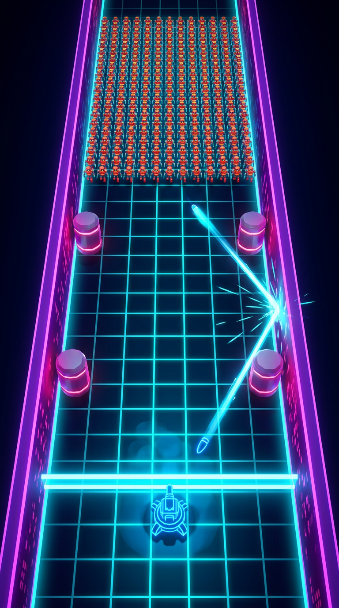

# CHAIN RIDER — Arena 2.5D Portrait

> **Bullet-steering crowd shooter.** Tembak satu peluru, masuk ke dalamnya, belokkan untuk membantai ratusan musuh.
> Mobile portrait 9:16, satu jempol, sesi 1–3 menit.



Repo ini berisi **paket desain + implementasi arena** lengkap: blueprint, style guide, struktur scene, skeleton kode Unity, spesifikasi prefab, wireframe UI, cue sheet audio, checklist optimasi & testing, dan **prototipe web yang bisa langsung dimainkan**.

---

## Mulai dari mana

| Kalau kamu… | Buka ini |
|---|---|
| Ingin **merasakan** mekaniknya dulu | `prototype/index.html` → jalankan server lokal (lihat di bawah) |
| Level designer | [`docs/01-arena-blueprint.md`](docs/01-arena-blueprint.md) → [`docs/10-level-variations.md`](docs/10-level-variations.md) |
| Technical artist | [`docs/02-visual-style-guide.md`](docs/02-visual-style-guide.md) → [`docs/05-prefab-spec.md`](docs/05-prefab-spec.md) |
| Programmer | [`docs/04-script-skeleton.md`](docs/04-script-skeleton.md) → `unity/Assets/ChainRider/Scripts/` |
| UI/UX | [`docs/06-ui-wireframe.md`](docs/06-ui-wireframe.md) |
| Audio | [`docs/07-audio-cue-sheet.md`](docs/07-audio-cue-sheet.md) |
| QA / produser | [`docs/08-optimization-checklist.md`](docs/08-optimization-checklist.md) → [`docs/09-testing-checklist.md`](docs/09-testing-checklist.md) |
| Game designer / balance | [`docs/11-balance-and-deviations.md`](docs/11-balance-and-deviations.md) → [`docs/12-aim-mode-comparison.md`](docs/12-aim-mode-comparison.md) |
| Mau menjalankan di Unity | [`docs/13-unity-mvp-setup.md`](docs/13-unity-mvp-setup.md) |

---

## Deliverables

| # | Dokumen | Isi |
|---|---|---|
| 1 | [Blueprint Arena](docs/01-arena-blueprint.md) | Grid ASCII 5 varian, koordinat presisi, zona, dinding, aturan penempatan. **Di-generate otomatis** dari data. |
| 2 | [Visual Style Guide](docs/02-visual-style-guide.md) | Palet, lighting rig, post-processing, material, bahasa VFX, referensi |
| 3 | [Scene Hierarchy](docs/03-scene-hierarchy.md) | Struktur folder, hierarchy Unity lengkap, 44 script, urutan eksekusi, padanan Godot 4 |
| 4 | [Script Skeleton](docs/04-script-skeleton.md) | Peta kode + 6 keputusan teknis yang menentukan arsitektur |
| 5 | [Prefab Spec](docs/05-prefab-spec.md) | 25+ prefab dengan budget tris, material, pool size, shadow |
| 6 | [UI Wireframe](docs/06-ui-wireframe.md) | Wireframe portrait, anatomi HUD, safe area, tipografi |
| 7 | [Audio Cue Sheet](docs/07-audio-cue-sheet.md) | 16 cue SFX, pitch ladder, musik dinamis, mixing, timing diagram |
| 8 | [Optimization Checklist](docs/08-optimization-checklist.md) | Anggaran frame 16.6 ms, pooling, batching, LOD, tier device |
| 9 | [Testing Checklist](docs/09-testing-checklist.md) | Performa, determinisme, gameplay — dengan kriteria lolos |
| 10 | [Level Variations](docs/10-level-variations.md) | 5 arena: maksud desain, tema, musuh spesial, boss |
| 11 | [Balance & Deviasi Spec](docs/11-balance-and-deviations.md) | **Baca ini sebelum mengubah angka.** Deviasi desain dari spec awal beserta buktinya, hasil balance pass 30 run, dan daftar lever yang terbukti tidak berpengaruh |
| 12 | [Perbandingan Mode Bidikan](docs/12-aim-mode-comparison.md) | Keputusan kontrol MVP: bidik manual vs sapuan otomatis, 30 run per konfigurasi |
| 13 | [Setup Unity MVP v1](docs/13-unity-mvp-setup.md) | Cara membuka project Unity dalam 3 langkah + batas jujur MVP |

---

## Prototipe Interaktif

Prototipe web menjalankan **aturan yang sama** dengan spec Unity: fixed-step 60 Hz, ricochet analitik tanpa physics engine, bullet riding + slow-mo, 5 varian arena yang dibaca langsung dari `Config/arena_config.json`.

```bash
python3 -m http.server 8080 --bind 0.0.0.0
# buka http://localhost:8080/prototype/
```

**Kontrol:** `tap`/`klik` = tembak (atau rem saat riding) · `drag` = belokkan peluru · `←` `→` = steer keyboard · `1`–`5` = ganti arena · `R` = restart

Gunakan prototipe ini untuk **iterasi layout sebelum masuk Unity** — memindahkan bumper di JSON lalu me-refresh browser jauh lebih cepat daripada rebuild scene.

---

## Kontrol (MVP v1)

| Keadaan | Gestur | Aksi |
|---|---|---|
| Idle | tahan & geser mendatar | membidik (layar penuh = 116°) |
| Idle | lepas | menembak |
| Bullet-riding | geser mendatar | membelokkan peluru |
| Bullet-riding | tap | mengerem |

Bidik manual dipilih lewat pengukuran, bukan selera: mode sapuan otomatis membuat
kemahiran **tidak terbayar** (pemula menang 10%, pemain mahir 0%), karena pemain
hanya menguasai waktu tembak dan bermain lebih selektif justru memotong laju
tembak. Mode manual: pemula 3%, mahir 33%. Detail di
[doc 12](docs/12-aim-mode-comparison.md).

---

## Harness Simulasi & Status Balance

Balance game ini **diukur, bukan ditebak**. `tools/sim_test.js` memuat logika
gameplay langsung dari `prototype/index.html` (tidak ada duplikasi aturan),
menstub DOM/Canvas/WebAudio, lalu menjalankan run penuh dengan bot.

```bash
node tools/sim_test.js                 # semua varian, bot standar
node tools/sim_test.js --bot=skilled   # bot mahir
node tools/sim_test.js --determinism   # uji replay 120 detik x 5 varian
```

Kondisi saat ini (6 seed × 5 varian = 30 run, bot skilled):

| Metrik | Hasil | Target |
|---|---|---|
| Durasi sesi rata-rata | 105 detik | 60–180 detik ✓ |
| Run dalam jendela target | 29/30 | — |
| Mencapai boss (wave 5) | 30/30 | — |
| Bot menang | 3/30 (10%) | 5–20% ✓ |
| Pelanggaran invariant | 0 | 0 ✓ |
| Determinisme | identik | identik ✓ |

Harness ini menemukan dua cacat yang tidak terlihat dari membaca kode: peluru
yang tidak pernah memantul (0.10 bounce/peluru) dan bug determinisme pada
Splitter yang lolos karena uji lama terlalu pendek. Keduanya dijelaskan di
[doc 11](docs/11-balance-and-deviations.md).

---

## Struktur Repo

```text
Config/arena_config.json     ← SUMBER KEBENARAN TUNGGAL (arena, bullet, spawn, 5 varian)
tools/blueprint_gen.py       ← generator docs/01 dari JSON di atas
prototype/index.html         ← prototipe 2.5D playable (canvas, tanpa dependency)
docs/                        ← 10 dokumen deliverable + referensi visual
unity/Assets/ChainRider/
  Scripts/
    Core/      SimClock, DeterministicRng, GameEvents, ArenaBounds, ArenaManager
    Bullet/    BulletController, BulletSystem, RicochetSolver, BulletData, BulletView
    Crowd/     CrowdManager, FormationBuilder, EnemyData
    Camera/    CameraRig
    Time/      SlowMoSystem
    Obstacles/ ObstacleField
    Input/     InputRouter
    Pooling/   ObjectPool, PoolRegistry
    UI/        HudController, FloatingTextSpawner, ComboPopup
    Audio/     AudioDirector
    Config/    ConfigSO (semua ScriptableObject)
    Debug/     ReplayRecorder, PerfHud
```

Ubah `Config/arena_config.json` → jalankan `python3 tools/blueprint_gen.py` → blueprint & prototipe ikut ter-update.

---

## Enam Keputusan Arsitektur

1. **Fixed-step 60 Hz.** Slow-mo mengubah *berapa banyak* tick yang jalan, bukan ukurannya → replay tetap akurat walau pemain memicu bullet time.
2. **Ricochet analitik, bukan physics engine.** Swept-circle test (akar persamaan kuadrat) → deterministik lintas platform, anti-tunneling di 150% kecepatan.
3. **Musuh biasa ditembus, musuh berarmor memantulkan.** Kalau semua musuh memantulkan, 15 bounce habis dalam 0.2 detik di crowd rapat dan pemain kehilangan kendali. Brute & Shielder jadi "bumper hidup".
4. **Crowd = array struct + GPU instancing.** 200 MonoBehaviour = 8–12 ms/frame, seluruh budget habis. Spatial grid dibangun sekali per tick dengan counting sort, dipakai dua konsumen (peluru + separation).
5. **Satu pemilik waktu.** Hanya `SlowMoSystem` yang menulis `Time.timeScale`; sistem lain mengirim intent lewat event bus. Permintaan paling lambat menang.
6. **Gravity well memutar arah, bukan menambah velocity.** Menjaga cap kecepatan 150% sambil tetap menghasilkan lintasan melengkung.

Detail lengkap + alasannya ada di [`docs/04-script-skeleton.md`](docs/04-script-skeleton.md).

---

## Target Teknis

| Metrik | Target |
|---|---|
| Frame rate | 60 FPS @ Snapdragon 660, 200 musuh aktif |
| Frame budget | 16.6 ms (rincian per blok di dokumen 8) |
| RAM | < 200 MB |
| Build | < 100 MB (Android AAB) |
| GC | **0 B/frame** selama gameplay |
| Draw call | ≤ 45 |
| Determinisme | seed + input stream → run identik lintas device & frame rate |

---

## Constraint yang Dipatuhi

- [x] Portrait only, satu jempol
- [x] Sesi 1–3 menit (5 wave)
- [x] Tidak ada kontrol gerak player — player statis di `(0, 2)`
- [x] Semua mobilitas datang dari peluru
- [x] Tidak ada reload manual (auto-reload 0.35 s/peluru)
- [x] Tidak ada tombol lompat/dash
- [x] Semua efek dalam frame budget 16 ms (partikel di-cap 200, prioritas berjenjang)
- [x] Tidak memakai physics engine untuk ricochet (`RicochetSolver`, analitik)
- [x] Deterministik dan bisa direplay (`SimClock` + `DeterministicRng` + `ReplayRecorder`)
