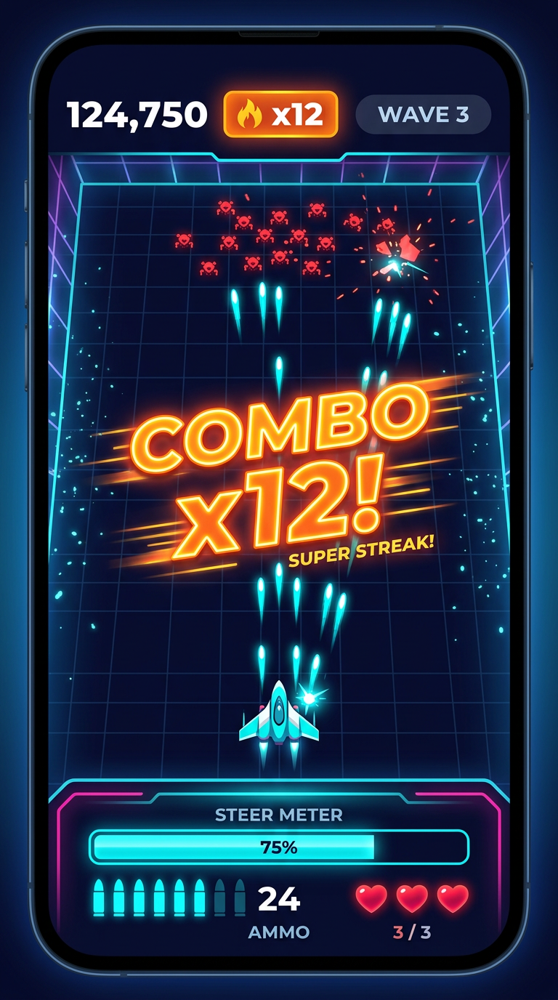

# 6. UI Wireframe Portrait — CHAIN RIDER



Resolusi acuan: **1080 × 1920** (9:16). CanvasScaler: `Scale With Screen Size`, match **width = 1.0** (lebar adalah dimensi kritis di portrait; tinggi bervariasi 18:9 – 21:9).

---

## 6.1 Wireframe Utama (gameplay)

```text
┌─────────────────────────────────────┐ ── 0 px
│            [ SAFE AREA TOP ]        │    notch / punch-hole
├─────────────────────────────────────┤ ── 88 px
│  ┌───────┐              ┌────────┐  │
│  │ 12,480│              │ WAVE 3 │  │  TOP BAR (h = 140 px)
│  │ SCORE │   ╔══════╗   │  /5    │  │  · Skor  : 72 px bold, putih
│  └───────┘   ║ x12  ║   └────────┘  │  · Combo : 84 px, gold #FFD54F, pulse
│              ╚══════╝               │  · Wave  : 44 px, pill outline cyan
├─────────────────────────────────────┤ ── 228 px
│ ╌╌╌╌╌╌╌╌ spawn gate (Z=40) ╌╌╌╌╌╌╌╌ │
│                                     │
│   ▪▪▪▪▪▪▪▪▪▪▪▪   crowd merah        │  SPAWN ZONE
│   ▪▪▪▪▪▪▪▪▪▪▪▪                      │  ≈ 22% tinggi layar
│   ▪▪▪▪▪▪▪▪▪▪▪▪                      │
│                                     │
│  ◉                          ◉       │  COMBAT ZONE
│         ╲                           │  ≈ 45% tinggi layar
│          ╲   ✦ bullet + trail       │  · bumper magenta
│           ╲                         │  · peluru cyan
│  ◉         ╲                ◉       │  · floating text "+100"
│             ╲                       │    muncul di sini
│              ╲                      │
│ ─────────── DEFENSE LINE ────────── │  cyan, selalu terlihat
│                                     │  PLAYER ZONE
│                 ▲ player            │  ≈ 12% tinggi layar
│                                     │
├─────────────────────────────────────┤ ── 1650 px
│  STEER  ▓▓▓▓▓▓▓▓▓▓▓▓░░░░░░░  2.1s   │  BOTTOM BAR (h = 200 px)
│                                     │  · Steer meter: bar penuh lebar
│  ●●●●○      ammo          ♥ ♥ ♡     │  · Ammo kiri, HP kanan
├─────────────────────────────────────┤ ── 1850 px
│         [ SAFE AREA BOTTOM ]        │    home indicator iOS
└─────────────────────────────────────┘ ── 1920 px

      ZONA JEMPOL (thumb zone)
      ╭───────────────────────╮
      │  tap  = tembak / rem  │  seluruh area gameplay
      │  swipe = belokkan     │  bisa disentuh — tidak ada
      ╰───────────────────────╯  tombol yang harus dibidik
```

---

## 6.1b Dua Elemen HUD Tambahan

| Elemen | Posisi | Perilaku |
|---|---|---|
| **Garis bidik** (aim indicator) | Dari muzzle, mengikuti sudut turret | Garis putus-putus memprediksi **2 pantulan** ke depan; tiap segmen lebih pudar dan lebih tipis, titik pantul diberi dot. **Disembunyikan saat riding**, karena saat itu tap berarti "rem" bukan "tembak" — indicator yang tetap tampil akan membohongi pemain. |
| **Bar HP boss** | Atas layar, di bawah HUD wave (`top: 96px`) | Muncul hanya saat wave 5. Nama boss + bar merah-oranye. Untuk Twin Warden, bar menunjukkan HP **gabungan** kedua bagian, sehingga revive terlihat sebagai bar yang naik lagi. |

Garis bidik memakai prediksi yang sama persis dengan simulasi (`RicochetSolver.PredictWallPath`).
Kalau batas yang dipakai indicator dan simulasi berbeda sedikit saja, indicator akan
berbohong. Diverifikasi numerik: **deviasi terburuk 0.43 unit pada 19 titik pantul**
(dalam toleransi radius peluru + substep).

---

## 6.1c Perubahan untuk loop Last War ATM (v2)

Wireframe di atas dibuat untuk loop lama (player diam, magasin 5 peluru). Tiga elemen berubah sejak loop squad + gate; sisanya tetap berlaku apa adanya.

| Elemen lama | Sekarang | Alasan |
|---|---|---|
| **Ammo** 5 ikon peluru | **Chain charge**, 2 pip 44 px, isi otomatis 4 detik | Tidak ada lagi magasin. Chain shot adalah sumber daya langka, bukan amunisi biasa — dua pip lebih mudah dibaca sekilas daripada lima. |
| — | **SQUAD xN**, pill cyan di bawah counter wave | Jumlah pasukan adalah HP **dan** DPS sekaligus. Ia angka terpenting di layar, jadi ia butuh tempatnya sendiri, bukan diselipkan ke label lain. Berubah merah saat ≤5 sebagai peringatan dini. |
| Garis bidik mengikuti sudut turret | Garis bidik **lurus ke depan dari posisi squad** | Posisi squad adalah bidikannya. Indicator tetap memprediksi 2 pantulan dengan matematika yang sama persis seperti simulasi. |

Elemen baru: **label gate** (`x2`, `+8`, `-6`, `/2`) digambar di panel gate itu sendiri, bukan di HUD — keputusannya ada di dunia, jadi angkanya harus ada di dunia juga. Panel positif cyan, negatif merah, dan meredup setelah dilewati supaya pemain tahu gate itu sudah terpakai.

Steer meter, HP, skor, combo, boss bar, floating text, damage flash, dan vignette slow-mo tidak berubah.

---

## 6.2 Anatomi Elemen

### Top Bar (`y: 88–228 px`)

| Elemen | Posisi | Ukuran | Style |
|---|---|---|---|
| Skor | anchor top-left, `(48, -48)` | 72 px | Bold, putih, angka tumbuh dengan *count-up tween* 0.2 s |
| Label "SCORE" | di bawah skor | 28 px | `#8A9BB8`, uppercase, letter-spacing +8% |
| Combo multiplier | anchor top-center | 84 px | `#FFD54F`, outline hitam 4 px, **scale pulse 1.0→1.15** tiap kenaikan |
| Wave counter | anchor top-right, `(-48, -48)` | 44 px | Pill outline cyan 3 px, format `WAVE 3/5` |

> Combo **tidak ditampilkan** saat bernilai 0 atau 1 — mengurangi kebisingan visual saat pemain belum membangun apa pun.

### Bottom Bar (`y: 1650–1850 px`)

| Elemen | Posisi | Spesifikasi |
|---|---|---|
| **Steer meter** | full width − 96 px margin, tinggi 24 px | `Image` filled horizontal, fill `#00E5FF`, track `#12233A`. **Alpha 0.25 saat tidak aktif**, 1.0 saat bullet riding. Menyala putih di 0.5 detik terakhir sebagai peringatan. |
| Sisa detik | kanan bar | 32 px, format `2.1s` |
| **Ammo** | bawah-kiri, `(48, 48)` | 5 ikon peluru 44 px, jarak 12 px. Ikon kosong = outline. Isi ulang otomatis (tidak ada tombol reload) dengan animasi fill 0.35 s. |
| **HP** | bawah-kanan, `(-48, 48)` | 3 hati 56 px. Hati hilang = outline + shake 0.3 s + flash merah layar. |

### Overlay (tidak memblokir input)

| Elemen | Perilaku |
|---|---|
| **Combo popup** | Muncul di tengah layar pada milestone x10/x20/x50/x100. Scale 0.4→1.25→1.0, alpha in 0.12 s, hold 0.6 s, out 0.25 s. Berjalan di **unscaled time** agar tetap cepat walau slow-mo. |
| **Floating text** | `+100` di lokasi kill (world→screen), naik 90 px/s, fade kuadratik, 0.8 s. Pool 32; kalau habis, teks **diagregasi** jadi satu popup total — lebih terbaca DAN lebih murah. |
| **Slow-mo vignette** | Vignette 0.22→0.42 + chromatic aberration 0→0.45 + tint biru `#00344D`. Blend mengikuti `SlowMoSystem.Blend`. |
| **Damage flash** | Full-screen `#FF1744` alpha 0.6 → 0, durasi 0.4 s. |
| **Near-miss warning** | Banner tipis di atas garis pertahanan, pulse merah, + heartbeat SFX. |
| **Perfect clear** | Sweep cahaya di garis pertahanan + banner "PERFECT" 0.8 s + `+50 coins`. |

---

## 6.3 Layar Non-Gameplay

```text
   MAIN MENU              PAUSE              RESULT (win/lose)
┌──────────────┐    ┌──────────────┐    ┌──────────────┐
│              │    │              │    │   VICTORY    │
│ CHAIN RIDER  │    │   PAUSED     │    │              │
│   (logo)     │    │              │    │ SCORE 24,180 │
│              │    │  ▶ RESUME    │    │ KILLS   312  │
│  ┌────────┐  │    │  ↻ RESTART   │    │ BEST x47     │
│  │  PLAY  │  │    │  ⌂ MENU      │    │ COINS  +180  │
│  └────────┘  │    │              │    │              │
│              │    │  ♪ ─────○    │    │ ┌──────────┐ │
│ [1][2][3]    │    │  ♫ ────○─    │    │ │  RETRY   │ │
│ [4][5] arena │    │              │    │ └──────────┘ │
│              │    └──────────────┘    │   ⌂ MENU     │
│  ⚙  🏆  🛒   │                        └──────────────┘
└──────────────┘
```

- **Pemilih arena** di menu: 5 kartu dengan thumbnail tema warna masing-masing + status "locked/unlocked".
- **Result screen** memakai count-up tween per baris (0.15 s jeda antar baris) — membuat angka terasa "diraih".
- Tombol utama minimum **160 × 160 px** (≈ 9 mm), berada di sepertiga bawah layar (zona jempol).

### 6.3a Status implementasi Godot

`godot/scripts/ui/screens.gd` — satu `CanvasLayer` (`layer = 2`) berisi ketiga layar,
karena ketiganya saling eksklusif dan berbagi skin yang sama.

| Elemen | Nilai terpakai |
|---|---|
| Tinggi tombol | 120 px, jarak antar tombol 24 px |
| Kolom konten | margin samping 90 px, tidak pernah masuk safe-top 88 px |
| Scrim | `bg_bottom` varian @ 78% — selalu jelas simulasi sedang berhenti |
| Judul menu | 104 px, outline 12, warna `primary` varian |
| Judul result | 88 px, `primary` saat menang / `#FF1744` saat kalah |
| Baris statistik | label 34 px `#8A9BB8`, nilai 40 px `#F5F9FF`, di dalam slab |

Baris result dibangun dari data run (array `{label, value}`), bukan template tetap,
sehingga menambah statistik tidak menuntut penataan ulang layar.
Belum ada: pemilih arena 5 kartu, slider audio, dan count-up tween per baris.

## 6.6 Sistem Tema

Semua warna berasal dari **satu** sumber: `variants.N.theme` di `Config/arena_config.json`.

- **Godot** — `godot/scripts/ui/ui_theme.gd` (`class_name UiTheme`) membangun `Theme`
  dari kode, bukan file `.theme`, karena palet baru diketahui saat runtime.
  `UiTheme.palette()` menormalkan dict varian; `panel()`, `slab()`, `bar_fill()`,
  `bar_track()` menghasilkan `StyleBox` beraksen; `build()` mengembalikan `Theme`
  berisi state Button + variasi tipe `NeonButton`; `style_label()` menyeragamkan teks.
  Konstanta netral: `INK #F5F9FF`, `INK_DIM #8A9BB8`, `DANGER #FF1744`, `GOLD #FFD54F`.
- **Lantai arena** — `godot/shaders/floor_grid.gdshader` (`unshaded`) menerima
  `bg_top/bg_bottom/grid_color/defense_color`; grid di-anti-alias dengan `fwidth`
  dan memudar sesuai kedalaman, garis pertahanan Z=5 selalu terang.
- **Prototipe web** — `applyTheme()` menulis custom property CSS
  (`--accent`, `--accentRGB`, `--accentLit`, `--enemy`, `--bgTop`, `--bg0`, `--track`)
  setiap kali varian berganti, jadi HUD, panel samping, dan bingkai stage
  ikut berubah bersama arena. Diverifikasi: 5 varian menghasilkan palet berbeda.

---

## 6.4 Aturan Tipografi

| Peran | Font | Ukuran @1080p | Warna |
|---|---|---|---|
| Angka besar (skor, combo) | Display Bold SDF | 72–84 px | Putih / `#FFD54F` |
| Label | Sans Semibold | 28–32 px | `#8A9BB8` |
| Tombol | Sans Bold | 44 px | Putih di atas `#00E5FF` |
| Floating text | Display Bold SDF | 40 px | `#FFD54F`, outline 3 px |
| Banner besar | Display Black SDF | 96 px | Putih, outline 6 px |

- **Semua teks memakai TextMeshPro SDF** — tajam di semua DPI, satu atlas, satu draw call.
- Kontras minimum **4.5:1** terhadap background tergelap.
- **Tidak ada teks di bawah 28 px.**
- Angka memakai *tabular figures* agar tidak "bergoyang" saat count-up.

---

## 6.5 Safe Area & Ergonomi

```csharp
// SafeAreaFitter.cs — dipasang di child pertama Canvas
Rect safe = Screen.safeArea;
rt.anchorMin = new Vector2(safe.xMin / Screen.width,  safe.yMin / Screen.height);
rt.anchorMax = new Vector2(safe.xMax / Screen.width,  safe.yMax / Screen.height);
```

| Aturan | Nilai |
|---|---|
| Margin horizontal minimum | 48 px |
| Jarak HUD ke area gameplay | 24 px |
| Elemen interaktif minimum | 160 × 160 px |
| Zona jempol nyaman | 0–35% tinggi layar dari bawah |
| Elemen yang **tidak boleh** ada di zona jempol | Skor, wave counter (info saja, di atas) |
| Rasio didukung | 16:9 sampai 21:9 (arena di-crop vertikal, HUD tetap) |

**Uji wajib:** iPhone SE (16:9, 375 pt), iPhone 15 Pro (19.5:9 + Dynamic Island), Galaxy S23 (19.5:9 punch-hole), tablet 4:3 (HUD tidak boleh melar — clamp lebar maksimum 1200 px).

---

## 6.3b Peta stage (campaign ladder)

Layar tangga 15 stage, dibuka lewat PLAY di menu utama. Alur: **menu → peta →
stage → hasil → kartu → kembali ke peta**.

```
  y=0     +----------------------------------------+
          |            (safe area 88)              |
  y=140   |               CAMPAIGN         72px    |
          |            3 / 15 CLEARED      28px    |
  y~300   +----------------------------------------+
          | +------------------------------------+ |  <- ScrollContainer
          | | STAGE 01  Classic Pit      CLEARED | |     viewport ~1424px
          | | BOSS COLOSSUS  DIF x1.00           | |     tinggi baris 120
          | +------------------------------------+ |     jarak antar-baris 20
          | | STAGE 02  Twin Towers         PLAY | |     konten 15x120+14x20
          | | BOSS TWIN_WARDEN  DIF x1.12        | |            = 2080px
          | +------------------------------------+ |
          | | STAGE 03  Gravity Chamber   LOCKED | |
          | +------------------------------------+ |
  y~1716  +----------------------------------------+
          |                MENU            120px   |
  y=1860  +----------------------------------------+
```

**Angka mengikat**

| Elemen | Nilai |
|---|---|
| Kolom | margin samping 90, atas 140, tinggi 1720 (dasar 1860/1920) |
| Baris stage | tinggi **120** (lantai tap docs/06 6.3a), jarak 20, lebar 900 |
| Judul / subjudul | 72px / 28px |
| Nama stage / baris bawah | 40px / 26px |
| Label status | 32px |

**Warna status** — `CLEARED` emas `#FFD54F`, `PLAY` primary varian,
`LOCKED` `INK_DIM` dengan isian 4%.

**Aturan perilaku**

- Stage terkunci **tetap ditampilkan**, hanya `disabled`. Melihat apa yang ada
  di depan adalah satu-satunya alasan layar tangga ini ada.
- Nama arena dan boss dibaca dari `variants[meta.variantCycle[stage % 5]]`,
  jadi peta menyebut arena yang benar-benar akan dimuat. Kesulitan
  `1 + difficultyPerStage * stage`.
- **Auto-scroll ke stage berjalan.** `scroll_vertical` dihitung
  `stage * 140 - (viewport - 120) / 2`, lalu Godot menjepitnya ke rentang bar.
  Stage 1 mendarat di 0, stage 8 di ~328, stage 15 terjepit di ~656 — ketiganya
  di dalam viewport.
- Scroll disetel **setelah dua `process_frame`**. ScrollContainer melaporkan
  viewport nol sebelum layout pass, dan offset yang dihitung di frame yang sama
  selalu mendarat di puncak berapa pun stage-nya.

**Bug progresi yang ikut diperbaiki** — `_on_card_chosen` dulu memanggil
`start_stage(_stage)`, mengulang stage yang baru saja dimenangkan: `_stage`
hanya dibaca dari `SaveGame` saat boot, jadi tangga tidak pernah naik dalam satu
sesi. Sekarang memilih kartu mengakhiri stage dan mengembalikan kendali ke peta,
sehingga unlock-nya terlihat.
